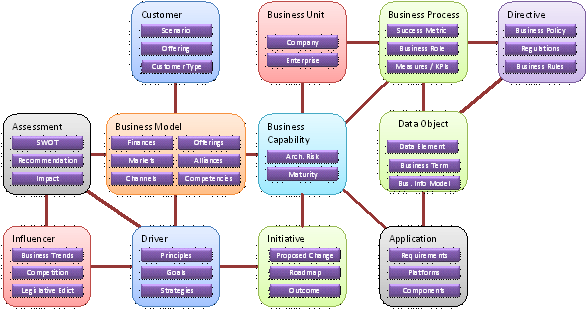

#+title: Enterprise Business Motivation Model for Emacs

Use Emacs to navigate elements and views from the [[https://motivationmodel.com][first open source
Enterprise Architecture Metamodel]].

* Installation
** Example Configuration (with use-package)
#+begin_src elisp
  (use-package ebmm
    :vc (:url "https://github.com/branjam4/emacs-ebmm.git"
	 :rev :newest)
    :commands (ebmm-mode ebmm-global-mode))
#+end_src
** Run in Appliance/Container
On GitHub:
1. With Docker, download and run the image from the GitHub Container
   Registry:
    #+begin_src sh
      $ docker pull ghcr.io/branjam4/emacs-ebmm:latest
      $ # run the image with next command
      $ docker run ghcr.io/branjam4/emacs-ebmm:latest
  #+end_src

2. If on Linux, a compressed archive is available in [[https://github.com/branjam4/emacs-ebmm/releases/tag/v0.1][Releases]] to
   download and can be used as follows:
   #+begin_src sh
     $ tar -xf v0-1-emacs-emacs-ebmm-tarball-pack.tar.bz2
     $ ./bin/emacs --eval='(ebmm-plantuml-demo)'
   #+end_src
* Example Usage (requires PlantUML and plantuml-mode)
** Check view (using Emacs Lisp)
#+begin_src elisp
  ;; Set EBMM mode to the Business Model view, generate a PlantUML
  ;; buffer from the elements and associations, then open an SVG diagram
  ;; in another window.
  (with-current-buffer
      (ebmm-plantuml-view (ebmm-mode "Business Model Viewpoint"))
    (plantuml-preview 4))
#+end_src
** Check view (using menus)
1. Require/load the =ebmm= library: using an installation method above
   should take care of this. If you have installed this package
   another way, use ~load-library~ interactively, or ~(require 'ebmm)~
   in lisp.
2. Activate ~ebmm-mode~: on a default Emacs install, press the Alt key
   with x, and put "ebmm-mode" in the minibuffer (in Emacs terms, type
   =M-x ebmm-mode=).
3. If ~menu-bar-mode~ (on by default) is activated, you should see a
   menu at the top named /"Enterprise"/. You can click on this menu
   and select =Browse View (in PlantUML)=. You can also right click in
   the buffer and find the /"Enterprise"/ submenu if ~menu-bar-mode~
   is off.
4. Select a view from the prompt in the minibuffer. It should open a
   PlantUML buffer showing the classes/elements and relationships
   within the view.
5. (Optional) If you have PlantUML and ~plantuml-mode~ installed,
   press =C-c C-c= (or =M-x plantuml-preview=) to see a diagram of the
   view.
* What is the Enterprise Business Motivation Model?
[[https://github.com/EnterpriseBusinessMotivationModel/Sparxmodel#what-is-the-ebmm][Quoted from the model's author]], Nick Malik:
#+begin_quote
The Enterprise Business Motivation Model is an Enterprise Architecture
metamodel.  That means it is a visual description of the concepts in
use in Enterprise Architecture, along with one or more relationships
between the concepts to aid in understanding them in relation to one
another.  Like any metamodel, it is used to create models where each
item in the created model is of a type defined in the metamodel.  It
is this nature of inheritance that makes the metamodel powerful.  Note
that this metamodel predates the first one released by The Open Group
in their TOGAF framework.  There may be some overlap and potentially
disagreement.  That should be expected.
#+end_quote

** Browsing the metamodel
Adapted from [[https://motivationmodel.com/ebmm5][EBMM Documentation (see =Enterprise BMM v4 >
Documentation > Overview > ⪻document⪼ Description=)]]:

#+begin_quote
When first approaching the Enterprise Business Motivation Model, it
helps to start with the highest level objects and to see the model as
a fairly simple construction.

The EBMM is, first and foremost, a way to describe a complex
organization that allows interesting insight to be gained. It is a
tool, a competitive weapon, to be wielded by any business leader that
is interested in moving his or her business from simply being “good”
to being truly great.

Understanding about a business does not emerge from a single method or
approach. It emerges because the basic information about the business
is so well organized that a hundred different methods can be applied,
each to refine or improve the business in some key way.

The information structure for describing a business must, therefore,
cope with information that may exist in many forms, and different
levels of detail. The EBMM provides this flexibility, because the
various elements of a business can be described and refined
independently, producing interesting observations and ideas for
enhancement, without the need for every detail to be captured
first.

The EBMM itself is not complex. Yet it is more complex than many of
the models in use by business consultants. In developing this model,
we took the advice of Einstein: Make everything as simple as possible,
but not simpler. That is precisely what the Enterprise Business
Motivation Model is, and does. It is a simple model, but not too
simple. Interesting and useful illustrations can be created
specifically because of this rich balance between simplicity and
completeness.
#+end_quote
* Why use Emacs to interact with the metamodel?
There are 104 model elements, over 200 relationships between those
elements, and dozens of views over those elements. While one can
[[https://motivationmodel.com/ebmm5][browse through the model online]], or [[https://github.com/EnterpriseBusinessMotivationModel/Sparxmodel/EBMM%20XMI%20v5.0.zip][grab a copy of the Sparx XMI]] and
extract desired documentation through queries, the author of this
package believes Emacs is one of the better local interfaces for
navigating a model of this size: larger than what fits in working
memory when you manually refer to it, but not so large that only big
AI models or clever programming can make sense of it.
* Future Work on the Horizon
Another benefit of working with the EBMM in Emacs is being able to
overlay the ontology on top of any other models that expose text
interfaces. The author anticipates:
1. Collating information from business transactions, directives, and
   models;
2. Displaying the information under their appropriate EBMM element;
3. Displaying the information in any model constructs (e.g a Business
   Scorecard) containing the associated element.
